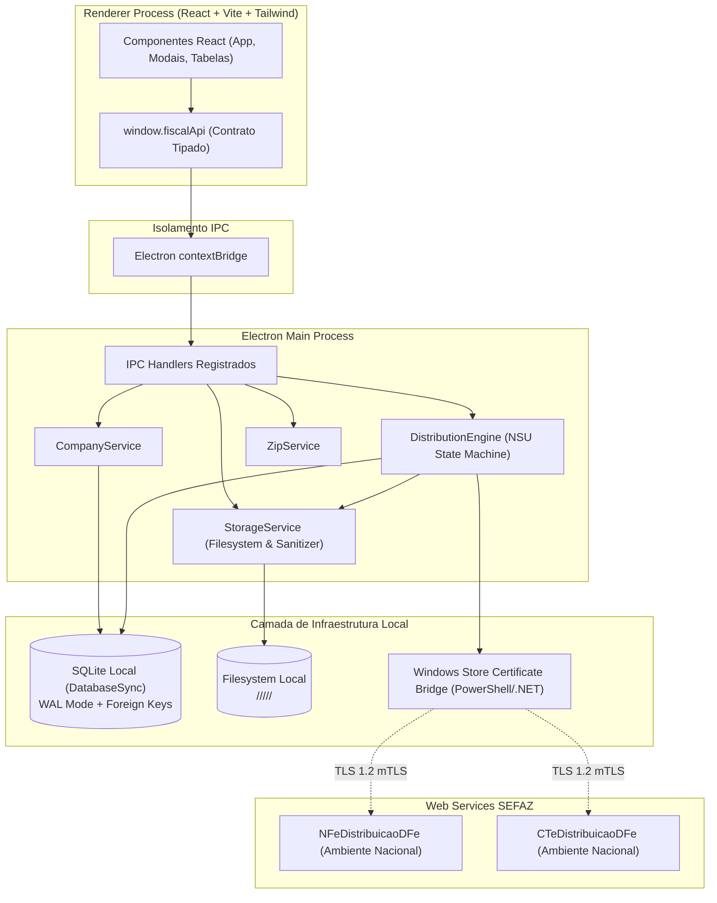

# Arquitetura do Sistema - Buscador NF-e / CT-e Desktop

**Documento:** `docs/ARCHITECTURE.md`  
**Data:** 03 de Outubro de 2026  
**Padrão:** Clean Architecture / Hexagonal / Processos Segregados Electron

---

## 1. Visão Geral

A aplicação foi concebida seguindo o princípio da estrita separação de responsabilidades e segurança por isolamento de processos (Process Sandboxing).

---

## 2. Camadas do Sistema

1. **Domínio (`packages/domain`):**
   * Tipos puros, modelos e Value Objects: `CNPJ`, `NSU`, `AccessKey`, `DocumentType`.
   * Regras matemáticas puras: algoritmo Módulo 11 de validação de CNPJ, comparação de NSU de 15 dígitos com `BigInt`, validação de dígito verificador da Chave de Acesso (44 dígitos). Zero dependência de frameworks.

2. **Banco de Dados (`packages/database`):**
   * Conexão `DatabaseSync` com `PRAGMA journal_mode = WAL;` e `PRAGMA foreign_keys = ON;`.
   * Repositórios tipados: `CompanyRepository`, `CertificateRepository`, `DistributionStateRepository`, `DocumentRepository`, `SettingsRepository`.
   * Suporte a transações atômicas com rollback automático em caso de falha.

3. **Filesystem & Armazenamento (`packages/storage`):**
   * `PathSanitizer`: Prevenção contra Directory Traversal e caracteres proibidos no Windows.
   * `StorageService`: Organização de arquivos em `<Pasta>/<Empresa>/<Tipo>/<Ano>/<Mes>/<Chave>.<ext>`.
   * `ReconciliationService`: Verificação e reparo de consistência entre arquivos no disco e registros no banco.

4. **Certificados Digitais (`packages/certificates`):**
   * Interface desacoplada `ICertificateProvider`.
   * `WindowsStoreCertificateProvider`: Consome certificados diretamente do repositório `Cert:\CurrentUser\My` do Windows via bridge PowerShell/.NET (Schannel). Chaves privadas permanecem no hardware/KSP do Windows.
   * `MockCertificateProvider`: Provedor para testes automatizados offline.

5. **Fiscal & SEFAZ (`packages/fiscal`):**
   * `NFeParser` e `CTeParser`: Descompressão de lotes `docZip` (Base64 + GZIP) e normalização de `procNFe`, `resNFe`, `procCTe` e `resCTe`.
   * `DistributionEngine`: Orquestrador transacional que executa consultas, grava documentos, atualiza NSU no SQLite e respeita limites de taxa da SEFAZ.

6. **Interface do Usuário (`src/`):**
   * React 18 com TypeScript, Vite, Tailwind CSS e ícones Lucide.
   * Layout desktop sem dashboards ou gráficos: foco total em arquivo fiscal, listagem limpa, filtros rápidos e download.
