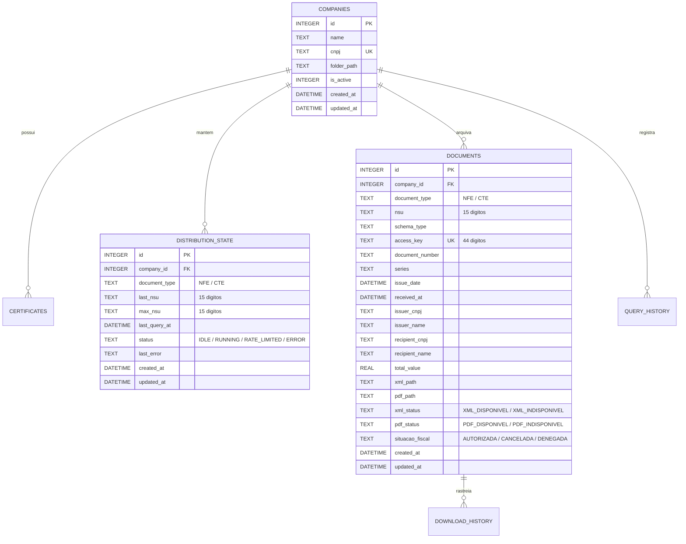

# Documentação do Banco de Dados SQLite

**Arquivo:** `docs/DATABASE.md`  
**Motor:** SQLite Local com `DatabaseSync` (Node.js nativo / WAL Mode)  
**Localização do Arquivo:** `data/fiscal_storage.db`

---

## 1. Visão Geral e Princípios de Arquitetura

O banco de dados SQLite local armazena **estritamente metadados estruturados**, ponteiros de arquivos e estados de sincronização. Os arquivos físicos (XML e PDF) são persistidos no **filesystem local** com caminhos sanitizados e validados.

### Diretrizes de Integridade:
* **WAL Mode (Write-Ahead Logging):** Ativado via `PRAGMA journal_mode = WAL;` para concorrência de leitura e escrita com alta performance.
* **Foreign Keys:** Estritamente ativadas (`PRAGMA foreign_keys = ON;`) com comportamento `CASCADE` para garantir consistência referencial.
* **Transacionalidade Atômica:** Qualquer operação de atualização de NSU ou lote de documentos é envolvida em transações (`BEGIN TRANSACTION` / `COMMIT` / `ROLLBACK`). Se qualquer erro ocorrer durante o processamento do lote, a transação sofre rollback e o NSU **nunca é avançado indevidamente**.

---

## 2. Diagrama Entidade-Relacionamento

---

## 3. Descrição das Tabelas e Constraints

### 3.1 `companies`
Armazena as empresas cadastradas pelo usuário.
* `id`: Chave primária autoincrementada.
* `name`: Razão Social ou Nome Fantasia.
* `cnpj`: Somente os 14 dígitos numéricos (com constraint `UNIQUE`). Impede cadastros duplicados.
* `folder_path`: Diretório customizado para salvar documentos da empresa.
* `is_active`: Flag booleana (0 ou 1) que identifica a empresa ativa selecionada no topo da interface.

### 3.2 `distribution_state`
Mantém o estado transacional do NSU por empresa e por serviço.
* `company_id` + `document_type`: Par com constraint `UNIQUE(company_id, document_type)`. O NSU da NF-e é **100% independente** do NSU do CT-e.
* `last_nsu`: Último NSU confirmado e persistido (15 dígitos com zeros à esquerda). Inicializado com `000000000000000`.
* `max_nsu`: Maior NSU disponível na SEFAZ retornado pela última consulta.
* `status`: Máquina de estados (`IDLE`, `RUNNING`, `RATE_LIMITED`, `ERROR`).

### 3.3 `documents`
Catálogo de documentos fiscais eletrônicos recebidos.
* `access_key`: Chave de acesso de 44 dígitos com constraint `UNIQUE`.
* **Idempotência (UPSERT):** Se a SEFAZ reenviar um documento ou um evento posterior (como quando um resumo `resNFe` é substituído pelo XML completo `procNFe`), a cláusula `ON CONFLICT(access_key) DO UPDATE` atualiza os metadados com segurança sem gerar registros redundantes no banco.
* Índices cobrem `company_id`, `access_key`, `nsu`, `issue_date`, `issuer_cnpj`, `recipient_cnpj` e `document_type` para garantir buscas instantâneas por período.
